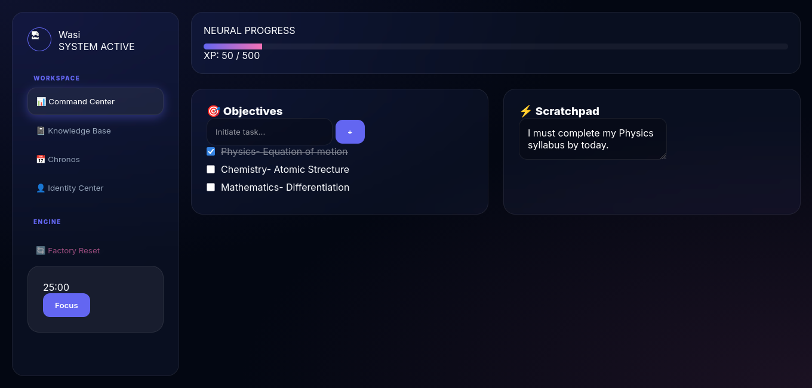
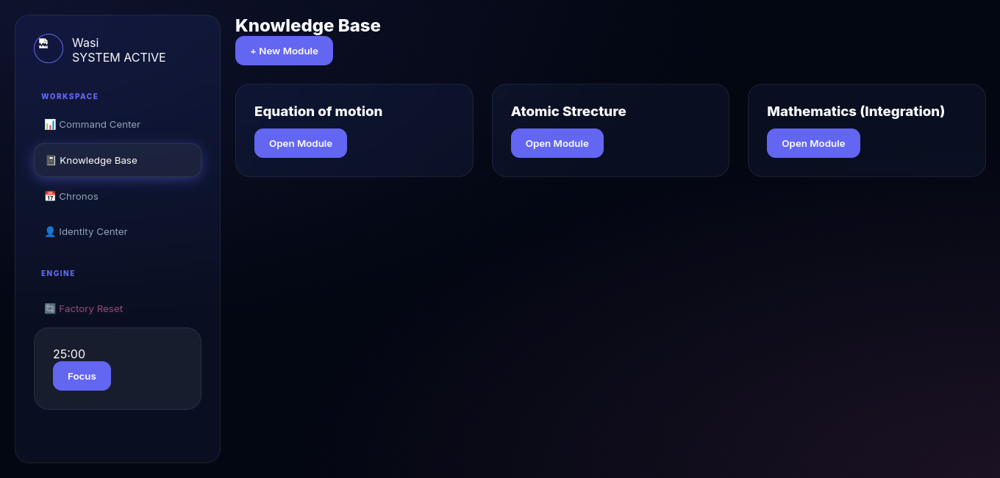
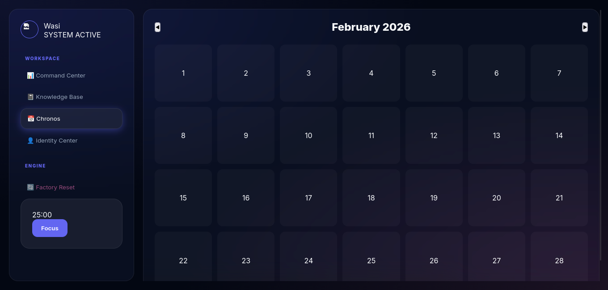
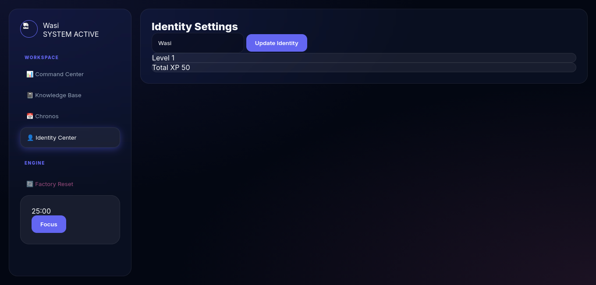
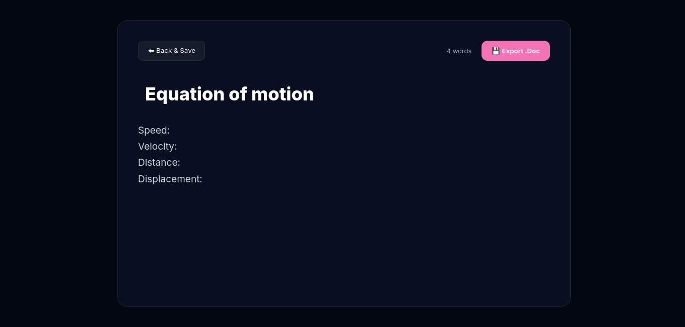

# Study Operating System |

**Study Operating System** is a privacy-first, gamified productivity dashboard designed to bridge the gap between deep work and organized note-taking. Built with a modular vanilla JavaScript architecture, it offers a distraction-free environment for scholars and professionals.

---

## ✨ Key Features

### 📝 Immersive Pro Writer
A full-screen, dedicated word processor that mimics a professional desktop environment. 
- **Serif Typography:** Optimized for long-form reading and writing.
- **Rich Formatting:** Integrated Bold, Italic, and List controls.
- **Export Ready:** Save your work directly to `.DOCX` or print to `.PDF`.

### 🎮 Gamified Productivity
- **XP System:** Earn 50 XP for every task completed.
- **Leveling Logic:** Track your progress as you scale through elite levels.
- **Dynamic HUD:** Real-time counters for Pending and Completed objectives.

### 🛡️ Privacy & Security
- **Local-First Protocol:** No data ever leaves your machine. Everything is stored in `localStorage`.
- **Zero-Cloud:** No tracking, no cookies, and no third-party scripts.
- **Sandbox Environment:** Operates entirely in the browser client.

### 🎨 Elite UI/UX
- **Quick Theme Toggle:** Seamlessly switch between Dark and Light modes.
- **High-Capacity Scratchpad:** A dedicated side-panel for rapid, temporary thoughts.
- **Glassmorphism Design:** Modern, blurred-interface aesthetic for focus.

---

## 🛠️ Tech Stack

- **Frontend:** HTML5, CSS3 (Custom Properties & Glassmorphism)
- **Logic:** Vanilla JavaScript (ES6+ Modular Architecture)
- **Persistence:** Web Storage API (`localStorage`)
- **Typography:** Google Fonts (Inter & Lora)

---

## Screenshots

